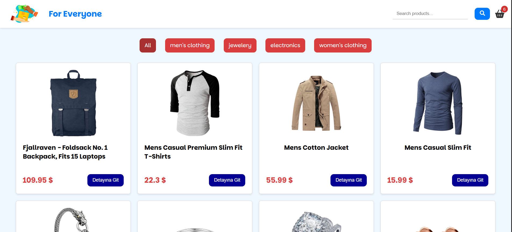

#Geliştirici
Bu proje Cenk Aktaş tarafından geliştirilmiştir.

GitHub: [Cenk Aktaş](https://github.com/Cenkaktas1)

LinkedIn: [Cenk Aktaş](https://www.linkedin.com/in/cenk-akta%C5%9F-a4ab66362/)

# 🛍️ React & Redux E-Ticaret Uygulaması

Bu proje, modern web teknolojileri kullanılarak geliştirilmiş, bir E-Ticaret simülasyonudur. Kullanıcıların ürünleri filtreleyebileceği, detaylarını inceleyebileceği ve sepete ekleyebileceği dinamik bir yapı sunar.

Projede **State Management** (Durum Yönetimi) için **Redux Toolkit** kullanılmış olup, componentler arası veri akışı profesyonel bir mimariyle kurgulanmıştır.


*(Not: Buraya projenin en güzel ekran görüntüsünü koyabilirsin)*

## 🚀 Özellikler

- **Ürün Listeleme:** API'den çekilen ürünlerin dinamik olarak listelenmesi.
- **Detaylı Filtreleme:**
  - **Kategori Bazlı:** Seçilen kategoriye göre ürünlerin anlık filtrelenmesi.
  - **Arama Çubuğu:** Ürün ismine göre canlı (live) arama yapabilme.
- **Ürün Detay Sayfası:** Her ürün için özel oluşturulan dinamik route yapısı (`/detail/:id`).
- **Sepet Yönetimi:**
  - Sepete ürün ekleme.
  - Ürün adedini artırma/azaltma.
  - Sepetten ürün silme.
  - Toplam fiyatın anlık hesaplanması.
- **Loading State:** Veriler yüklenirken kullanıcıya geri bildirim veren yükleme ekranı.

## 🛠️ Kullanılan Teknolojiler

Bu projede aşağıdaki kütüphaneler ve teknolojiler kullanılmıştır:

| Teknoloji | Açıklama |
| --- | --- |
| **React.js** | Kullanıcı arayüzü oluşturmak için. |
| **Redux Toolkit** | Global State yönetimi (Sepet ve Ürün verileri için). |
| **React Router DOM** | Sayfalar arası geçiş (Routing) için. |
| **Axios** | API isteklerini (HTTP Requests) yönetmek için. |
| **React Icons** | Modern ikon setleri için. |
| **Material UI (MUI)** | Badge (Sepet sayısı) gibi UI bileşenleri için. |
| **CSS3** | Özel stillendirme ve Flexbox yapısı için. |

## 📂 Proje Yapısı (Mimari)

Proje, sürdürülebilirlik ve okunabilirlik açısından modüler bir yapıda geliştirilmiştir:

```text
src/
├── components/      # Tekrar kullanılabilir bileşenler (Product, Header, Loading vb.)
├── css/             # Sayfa ve bileşenlere özel stil dosyaları
├── redux/           # Redux Slice ve Store yapılandırması
│   ├── store.js     # Ana depo
│   ├── basketSlice.js
│   └── productSlice.js
├── pages/           # Ana sayfalar (Home, Detail, Basket)
├── App.jsx          # Ana yönlendirme (Routing) yapısı
└── main.jsx         # Uygulamanın giriş noktası

./src/images/Basket.png
./src/images/Category.png
./src/images/Search.png


# Kurulum ve Çalıştırma

Projeyi yerel makinenizde çalıştırmak için aşağıdaki adımları izleyebilirsiniz:

Projeyi Klonlayın:

Bash

git clone [https://github.com/KULLANICI_ADIN/react-ecommerce-app.git](https://github.com/KULLANICI_ADIN/react-ecommerce-app.git)
Proje Dizinine Girin:

Bash

cd react-ecommerce-app
Gerekli Paketleri Yükleyin:

Bash

npm install
Uygulamayı Başlatın:

Bash

npm run dev